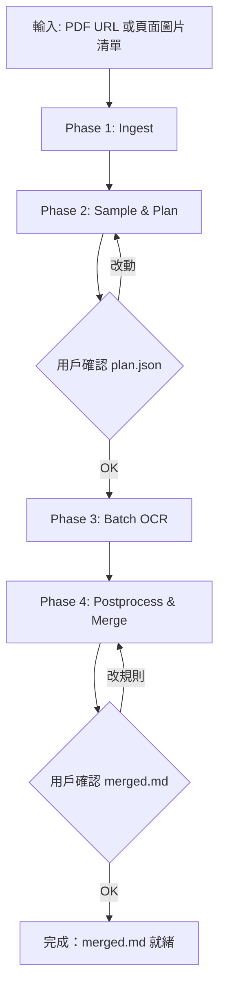
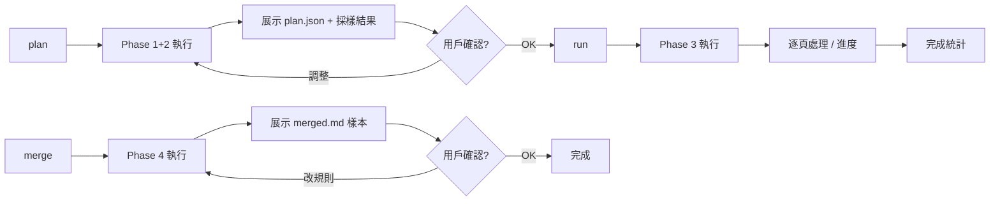

# Book OCR Skill Design

## Background

OpenTeochew 項目包含大量掃描版 PDF 書籍（字典、課本、語料），需要 OCR 提取文本並錄入 `pages` 表。現有 wiki 已積累兩篇 OCR 經驗筆記（[[marker-ocr-multicolumn-dictionary]]、[[ocr-superscript-postprocessing]]），但缺乏可重複執行的自動化管線。

目標：創建一個 opencode skill，接受 PDF URL 或頁面圖片，輸出帶頁碼標記的 OCR 文本，由用戶確認後接入 openteochew 的 D1 sync 管線。

## Scope

- **Skill** 所有權：`wiki/skills/book-ocr/`（含完整實現），符號鏈接到 `~/.agents/skills/book-ocr` 供 agent 自動發現
- **設計文檔**本文件：`code/dataset/docs/2026-06-23-book-ocr-skill-design.md`（dataset 項目分支 `feature/20260623/book-ocr-skill`）
- **排除範圍**：D1 sync（openteochew 倉負責）、R2 上傳（openteochew 倉 `upload-pdf.py`）、wiki source 卡片更新

## Architecture

### 5 階段流水線



| Phase | 動作 | 產出 | 自動/確認 |
|-------|------|------|-----------|
| 1. Ingest | 下載 PDF → pypdfium2 拆頁 → 渲染 WebP | `pages/NNNN.webp`、`meta.json` | 自動 |
| 2. Sample & Plan | 中部採樣 + 形態識別 + 生成 plan.json | `plan.json`、`samples/NNNN.{webp,md}` | **用戶確認** |
| 3. Batch OCR | 按 plan.json 逐頁 OCR（斷點續傳） | `md/NNNN.md`、`state.json`、`failed.json` | 自動 |
| 4. Postprocess & Merge | 後處理規則 + 合成 merged.md | `merged.md` | **用戶確認** |

### 輸入模式

- `--pdf-url <url>`：公開 PDF 直鏈 → 完整 5 階段
- `--images <glob>`：頁面圖片清單 → 跳過 Phase 1，從 Phase 2 開始

### 頁面形態（kind）分類

濃縮為 3 種 kind，通過 plan.json 的 `columns`、`has_rule_lines` 參數細分：

| kind | 適用的場景 | 檢測方法 | OCR 流程 | 
|------|-----------|----------|----------|
| `skip` | 封面、版權頁、空白頁無文字 | 暗像素比 < 1% 或 text-detection 行數 < 3 | 跳過 |
| `simple` | 單欄純文本（語料書、會話書） | text-detection 行寬 > 頁寬 * 0.7 | marker-pdf 默認 config，無 `force_layout_block` |
| `grid` | 多欄/雙欄字典、表格、音節表 | 有框線：scipy `maximum_filter1d` 網格匹配；無框線：text-box 聚類分簇；有橫線：橫向投影找行格 | marker-pdf `force_ocr=True` + `force_layout_block="Text"` + 過濾 TableProcessors + 逐 cell crop → OCR → 拼接 |

表格 / 多欄字典均歸入 `grid`，通過參數區分：
```json
{ "kind": "grid", "columns": 6, "has_rule_lines": true, "has_row_lines": false }
{ "kind": "grid", "columns": 2, "has_rule_lines": false }
{ "kind": "grid", "columns": 5, "has_rule_lines": true, "has_row_lines": true }  // 表格
```

### plan.json 結構

```json
{
  "slug": "A_Pronouncing_and_Defining_Dictionary_of_the_Swatow_Dialect",
  "meta": { "total_pages": 690, "source_url": "https://...", "dpi": 300 },
  "sampled_pages": [120, 245, 333, 410, 555, 600],
  "page_groups": [
    { "range": "1-18",     "kind": "skip",    "reason": "封面/版權/目錄" },
    { "range": "19-22",    "kind": "simple",  "columns": 1 },
    { "range": "23-650",   "kind": "grid",    "columns": 6, "has_rule_lines": true },
    { "range": "651-690",  "kind": "skip",    "reason": "索引/封底" }
  ],
  "postprocessing": ["sup-tags", "latex-math", "ocr-error-letters", "page-marker"],
  "confidence": "high",
  "note": "採樣 6 頁，832-879 之間缺採樣，兩側 kind 一致（grid, columns=6），可信"
}
```

`page_groups` 必須是連續不重疊的 range。`confidence` 在相鄰採樣 kind 不同時標 `"low"`，agent 必須在 review 時提示用戶。

## 技術棧

| 依賴 | 用途 | 來源 |
|------|------|------|
| `marker-pdf` >= 1.10.2 | OCR 引擎（含 surya-ocr 五個模型） | PyPI |
| `surya-ocr` (marker 自動安裝) | text-detection / layout / recognition | PyPI |
| `scipy` | 多欄網格匹配（`maximum_filter1d`） | PyPI |
| `PyMuPDF` (fitz) | PDF 渲染為圖像 | PyPI |
| `Pillow` | WebP 輸出 | PyPI |
| `requests` | PDF 下載 | stdlib |

模型自動下載（~3.1GB），無需 API key。

## 文件佈局

### Skill 位置

```
wiki/skills/book-ocr/                     # → ~/.agents/skills/book-ocr (symlink)
├── SKILL.md                              # 入口：觸發詞、流程概述、CLI 用法
├── references/
│   ├── strategies.md                     # 三種 kind 檢測+OCR 技術詳述（含 wiki 多欄字典經驗）
│   ├── plan-schema.md                    # plan.json 結構、欄位說明、範例
│   └── failure-modes.md                  # 已知坑對策一覽
└── scripts/
    ├── __init__.py
    ├── ocr_book.py                       # CLI 入口
    ├── ingest.py                         # Phase 1
    ├── sample.py                         # Phase 2
    ├── plan.py                           # plan.json 讀寫
    ├── batch_ocr.py                      # Phase 3
    ├── postprocess.py                    # Phase 4
    ├── strategies/
    │   ├── base.py                       # Strategy ABC
    │   ├── skip.py
    │   ├── simple.py
    │   └── grid.py
    ├── requirements.txt
    └── tests/
        ├── __init__.py
        ├── fixtures/
        │   ├── blank.webp
        │   ├── single_col.webp
        │   ├── multicol_with_rules.webp
        │   └── two_col_no_rules.webp
        ├── test_strategies.py
        ├── test_sample.py
        └── test_postprocess.py
```

### Workspace 佈局（運行時產出）

`<cwd>/tmp/ocr/<slug>/`（可 `--workspace` 覆寫，默認在 dataset 倉執行則為 `code/dataset/tmp/ocr/<slug>/`，已 gitignore）：

```
source.pdf
meta.json
pages/NNNN.webp
samples/NNNN.{webp,md}
plan.json
md/NNNN.md
state.json
merged.md
```

### CLI

```bash
python3 -m book_ocr plan   --pdf-url <url> --slug <slug>   [--workspace <dir>]  [--samples 8]
python3 -m book_ocr plan   --images <glob> --slug <slug>   [--workspace <dir>]
python3 -m book_ocr run    --slug <slug>                    [--workspace <dir>]  [--pages 23,187,300-310]
python3 -m book_ocr merge  --slug <slug>                    [--workspace <dir>]
python3 -m book_ocr status --slug <slug>                    [--workspace <dir>]
```

### 子命令工作流



## 後處理規則

| 規則 ID | 作用 | 來源 |
|---------|------|------|
| `sup-tags` | `<sup>N</sup>` → Unicode 上標 ¹²³⁴⁵⁶⁷⁸ | wiki/ocr-superscript-postprocessing §1 |
| `latex-math` | `$...$` 區塊正則處理（`\mathbf{}`, `\textbf{}`, `\overline{}`, `^N`, `_N`, `\Box` 等） | wiki §2-8 |
| `ocr-error-letters` | `<sup>l</sup>` / `<sup>i</sup>` / `<sup>î</sup>` → `¹` | wiki §6 |
| `page-marker` | 每頁前插 `<!-- page:N -->` | dataset 慣例 |
| `trim-headers` | 移除頁眉頁腳 | 可選，默認不啟用 |

規則均為純函數：`(text: str) → str`。

## 失敗模式

| 失敗 | 症狀 | 應對 |
|------|------|------|
| marker TableProcessor 卡死 | 進程 hung | grid 策略默認過濾 TableProcessor / LLMTableProcessor / LLMTableMergeProcessor |
| MPS 不兼容 TableRecPredictor | warning | 接受，自動退回 CPU |
| 模型首次下載失敗 | 網絡錯誤 | `plan` 前 preflight 試載一次，明確報「需先下載 ~3.1GB 模型」 |
| PDF 下載中斷 | 部分寫入 | `.partial` 後綴+完成後 rename |
| 採樣全空白 | 中部隨機 8 頁無文字 | 重試一輪，仍空白則報「PDF 可能無文本內容」 |
| 採樣 kind 衝突 | 相鄰採樣 kind 不同 | plan.json `confidence: "low"`，agent 提示用戶 |
| Phase 3 崩潰 | OOM / 重啟 | `md/NNNN.md` 存在即完成，`state.json` 續跑 |
| 單頁超時 | 卡在某一頁 | 每頁設 timeout（默認 300s）→ `failed.json` → 繼續下一頁 |
| 後處理破壞文本 | 正則誤匹配 | 保留原始 `md/NNNN.md`，只寫 `merged.md` |

## 測試策略

- **框架**：unittest（與 dataset 倉約定一致）
- **單元測試**：`tests/test_strategies.py`（4 個 fixture webp，測試 detect/ocr 接口）、`tests/test_sample.py`（採樣算法）、`tests/test_postprocess.py`（從 wiki 規則表抽 4 類 fixture）
- **Fixture**：`tests/fixtures/`（4-6 張代表性頁面 webp + expected markdown）
- **整合測試**：手動。選一本短書（< 50 頁）跑完 plan/run/merge，diff merged.md 與已知 output
- **首次提交**：fixture 為空時 `@unittest.skip("needs fixtures")`，跑通真實流程後補

## 非職責範圍

- 不做 D1 sync（openteochew 倉 `sync-entries.sh --pages-only` 負責）
- 不做 R2 上傳（openteochew 倉 `upload-pdf.py` 負責）
- 不做 wiki source 卡片更新
- 不做 entriy 級別解析（dataset 倉 `scripts/processors/` 負責）